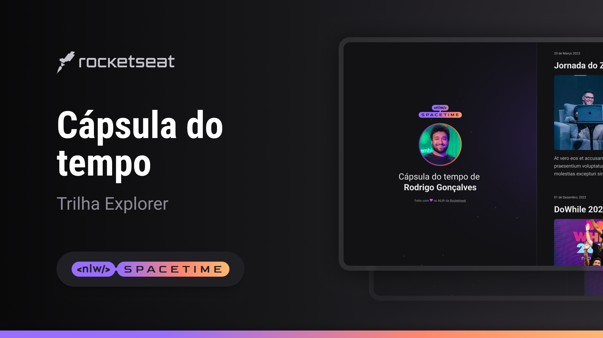

  

~

##💻 Projecto
Este é um projecto responsivo de uma cápsula do tempo para exibir memórias em uma linha do tempo.

##🚀 Tecnologias
Este projecto foi desenvolvido durante a NLW da rocketseat com as seguintes tecnologias:

-HTML
-CSS
Git e Github

## Layout
Você pode visualizar o layout do projecto no figma com esse [link](https://www.figma.com/file/bIlMIw8Bw2MrzRzpRxK3dK/C%C3%A1psula-do-tempo-%E2%80%A2-Trilha-Explorer-(Community)-(Copy)?type=design&node-id=306-84&t=Rax44neWDgtZ6jUH-0)

